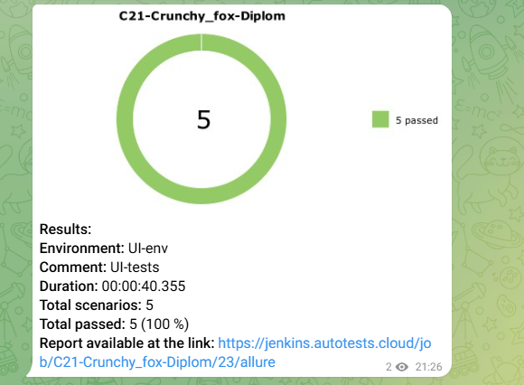
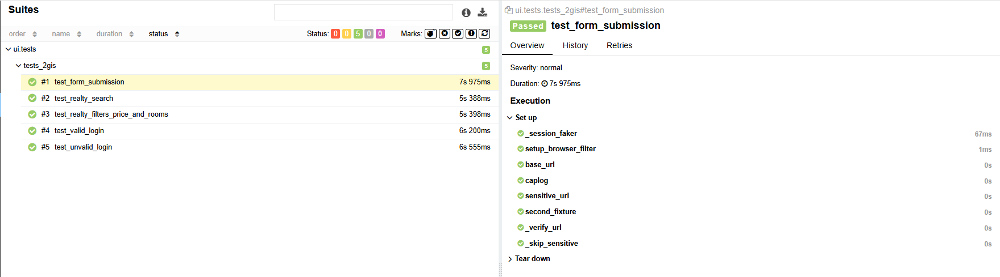

# 2gis дипломный проект  qa_guru ui-часть

2GIS Automation Testing Project — это дипломный проект, цель которого — продемонстрировать навыки автоматизации тестирования API и UI для реального веб-приложения.
В данном случае выбирается 2GIS (веб-версия + Web API) и проверяется:

**UI**:
- Корректность работы фильтров
- Поиск объектов в разных разделах (недвижимость, места)
- Проверка формы регистрации

 

Используемый стек:

  
  
  
   
   

